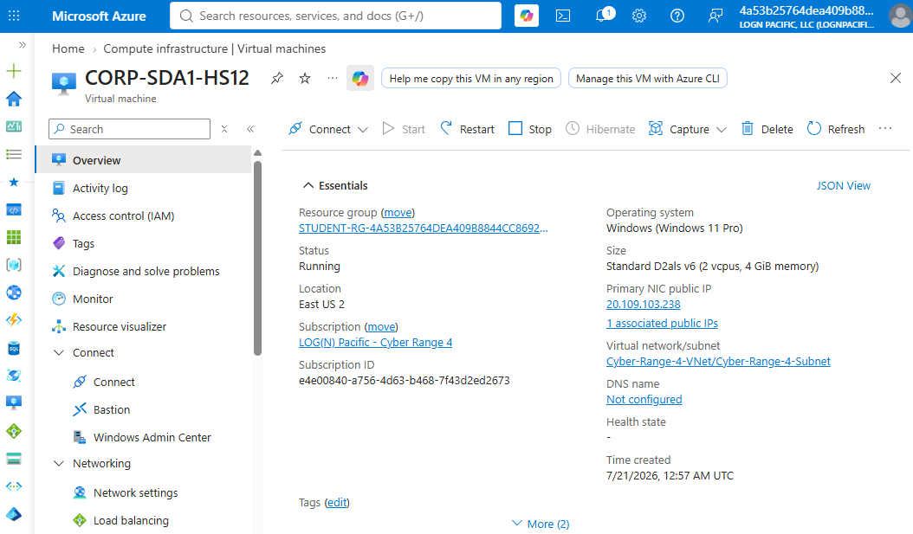
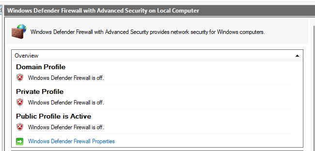
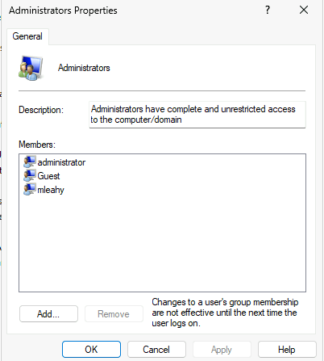
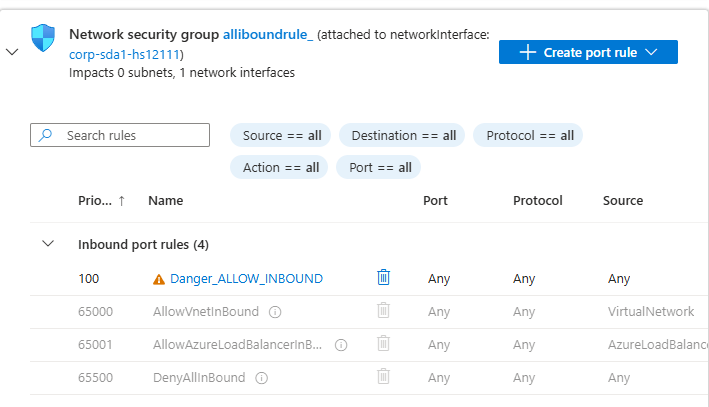
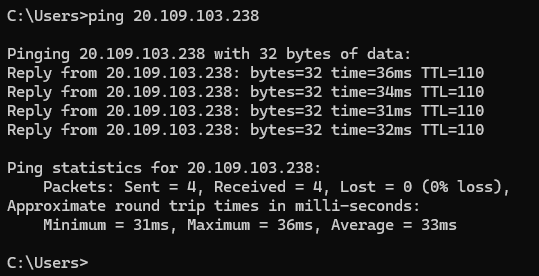
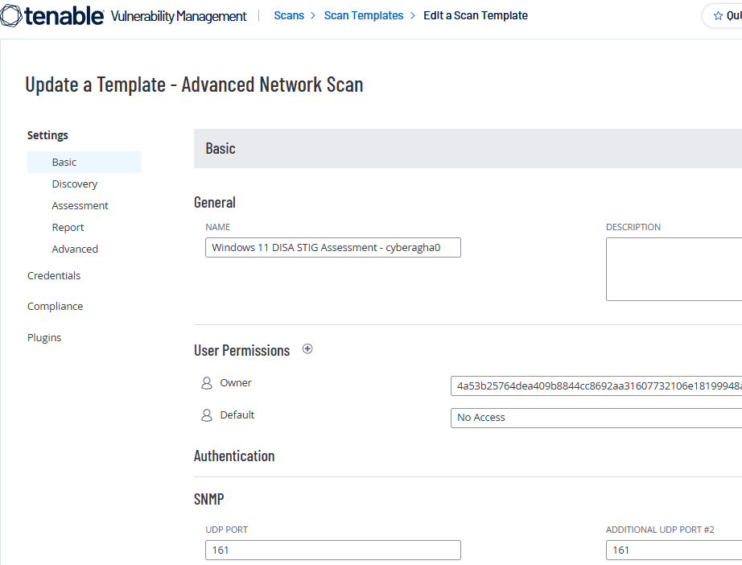
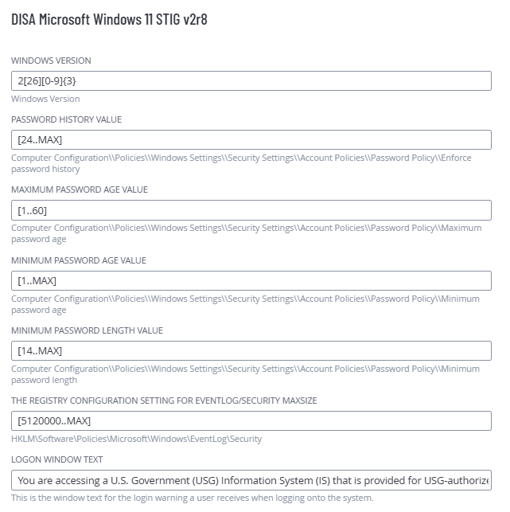
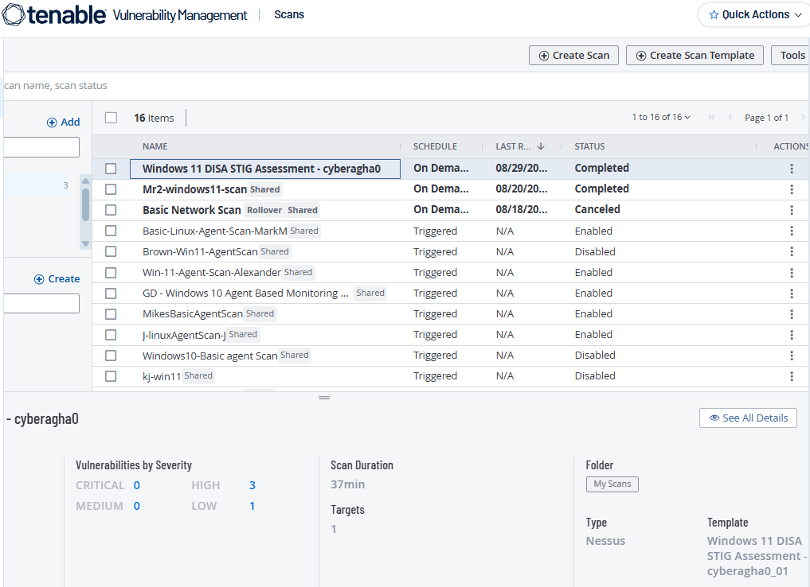

# 🛡️ Windows 11 DISA STIG Compliance Assessment

## 📌 Project Overview

This project demonstrates a vulnerability and compliance assessment of a **Windows 11 Pro virtual machine hosted in Microsoft Azure** using **Tenable Vulnerability Management**.

I intentionally introduced security misconfigurations into an isolated lab VM, configured a credentialed **Advanced Network Scan**, and assessed the system using the **DISA Microsoft Windows 11 STIG v2r8** compliance benchmark.

The scan identified **126 findings**, including **3 High**, **1 Low**, and **122 Informational** findings.

> ⚠️ **Lab Disclaimer:** All insecure configurations were intentionally created in an isolated, disposable Azure environment for authorized cybersecurity training.

---

## 🎯 Objectives

- Deploy a Windows 11 VM in Microsoft Azure
- Introduce controlled security misconfigurations
- Configure network connectivity for vulnerability scanning
- Build a Tenable Advanced Network Scan template
- Perform a credentialed Windows vulnerability assessment
- Apply the DISA Windows 11 STIG v2r8 compliance audit
- Analyze vulnerability and configuration findings
- Develop remediation recommendations

---

## 🧰 Technologies & Skills

| Technology | Usage |
|---|---|
| Microsoft Azure | Hosted the Windows 11 target VM |
| Windows 11 Pro | Target operating system |
| Tenable Vulnerability Management | Vulnerability and compliance scanning |
| DISA STIG | Windows security configuration benchmark |
| Azure NSG | Network access configuration |
| SMB / WMI | Credentialed Windows enumeration |
| Windows Defender Firewall | Host-based firewall testing |

---

# 🔬 Lab Implementation

## 1. Azure Windows 11 VM

A Windows 11 Pro virtual machine was deployed in Microsoft Azure as the target of the vulnerability and compliance assessment.

<b>📸 View Azure VM Screenshot</b>

 

**Figure 1:** Windows 11 Pro virtual machine deployed in Microsoft Azure.

---

## 2. Intentional Security Misconfigurations

Several security controls were intentionally weakened to create a vulnerable test environment.

### 🔥 Windows Firewall Disabled

Windows Defender Firewall was disabled across the Domain, Private, and Public profiles.

<b>📸 View Firewall Configuration</b>

 

**Figure 2:** Windows Defender Firewall disabled across all network profiles.

### 👤 Insecure Privileged Accounts

The built-in **Administrator** and **Guest** accounts were enabled, and the Guest account was placed in the local **Administrators** group.

<b>📸 View Local Administrator Configuration</b>

 

**Figure 3:** Intentionally insecure local account configuration.

### 🌐 Permissive Azure NSG

A temporary Azure Network Security Group rule allowed inbound traffic from any source to any destination and port.

<b>📸 View NSG Configuration</b>

 

**Figure 4:** Temporary permissive inbound NSG rule used for the isolated lab.

> **Security Impact:** These configurations increase the attack surface and would not be appropriate for a production environment.

---

## 3. Network Connectivity Validation

Connectivity to the Azure VM was verified before launching the vulnerability assessment.

<b>📸 View Connectivity Test</b>

 

**Figure 5:** Successful ICMP connectivity test to the Windows 11 VM.

---

# 🔎 Tenable Vulnerability Assessment

## 4. Advanced Network Scan Configuration

A reusable **Advanced Network Scan** template was created in Tenable Vulnerability Management.

The scan was configured for credentialed Windows assessment, allowing Tenable to perform deeper host enumeration using technologies such as:

- SMB
- WMI
- Windows Registry
- Administrative shares
- Windows services

<b>📸 View Tenable Scan Template</b>

 

**Figure 6:** Tenable Advanced Network Scan template used for the Windows 11 assessment.

---

## 5. DISA Windows 11 STIG Audit

The **DISA Microsoft Windows 11 STIG v2r8** compliance audit was added to the scan.

The benchmark evaluates security controls including:

- Password history
- Password age
- Minimum password length
- Windows event logging
- Security policy
- Logon configuration
- Registry-based security settings

<b>📸 View DISA STIG Configuration</b>

 

**Figure 7:** DISA Microsoft Windows 11 STIG v2r8 audit configuration in Tenable.

---

# 📊 Scan Results

The credentialed scan completed successfully against the Windows 11 VM.

| Severity | Findings |
|:---|---:|
| 🔴 Critical | **0** |
| 🟠 High | **3** |
| 🟡 Medium | **0** |
| 🔵 Low | **1** |
| ℹ️ Informational | **122** |
| **Total** | **126** |

<b>📸 View Completed Scan</b>

 

**Figure 8:** Completed Windows 11 DISA STIG assessment in Tenable Vulnerability Management.

---

# 🚨 Key Findings

## High — WinVerifyTrust Signature Validation

**Plugin ID:** `166555`  
**Finding:** WinVerifyTrust Signature Validation CVE-2013-3900 Mitigation (`EnableCertPaddingCheck`)

Tenable identified that the recommended Windows mitigation associated with CVE-2013-3900 was not enabled.

---

## High — Microsoft Outlook Security Update

**Plugin ID:** `193266`

Tenable identified a missing Microsoft Outlook for Windows security update.

---

## High — Microsoft Teams Remote Code Execution

**Plugin ID:** `250276`

The installed Microsoft Teams version was identified as affected by a remote code execution vulnerability addressed by a Microsoft security update.

---

## Low — Microsoft Teams Elevation of Privilege

**Plugin ID:** `264898`

An installed Microsoft Teams version was identified as affected by an elevation-of-privilege vulnerability.

---

# 🔐 Credentialed Scan Validation

The assessment successfully authenticated to the Windows host.

This allowed Tenable to perform host-level enumeration including:

- Local users and group memberships
- Windows password policy
- Installed software
- Windows services
- Registry configuration
- WMI information
- SMB configuration
- Security patch information

Successful credentialed enumeration provided significantly more visibility into the Windows host than a basic unauthenticated network scan.

---

# 🛠️ Remediation Recommendations

| Finding | Recommended Action |
|---|---|
| Windows Firewall disabled | Re-enable Windows Defender Firewall |
| Guest account enabled | Disable the Guest account |
| Excessive administrative privileges | Remove unnecessary users from Administrators |
| Permissive Azure NSG | Restrict inbound traffic using least privilege |
| Missing Windows/application updates | Apply current Microsoft security updates |
| WinVerifyTrust mitigation | Apply the recommended registry mitigation |
| DISA STIG failures | Harden the system according to applicable STIG controls |

A follow-up credentialed scan should be performed after remediation to verify that identified weaknesses have been corrected.

---

# 🧠 Key Takeaways

This project provided hands-on experience with:

- Vulnerability management
- Credentialed vulnerability scanning
- DISA STIG compliance assessment
- Windows security hardening
- Azure security configuration
- Vulnerability analysis
- Security remediation planning
- SMB and WMI enumeration
- Interpreting Tenable vulnerability findings

---

# 🧹 Lab Cleanup

After completing the assessment, the intentionally vulnerable Azure resources were removed to prevent continued exposure of the insecure test environment.

---

## ⚠️ Disclaimer

This project was conducted solely in an authorized cybersecurity lab environment. The vulnerable configurations documented in this repository were intentionally created for educational and security-testing purposes.
