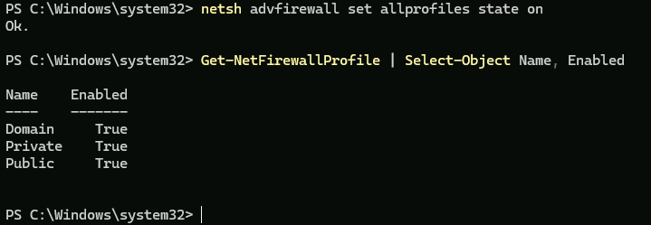
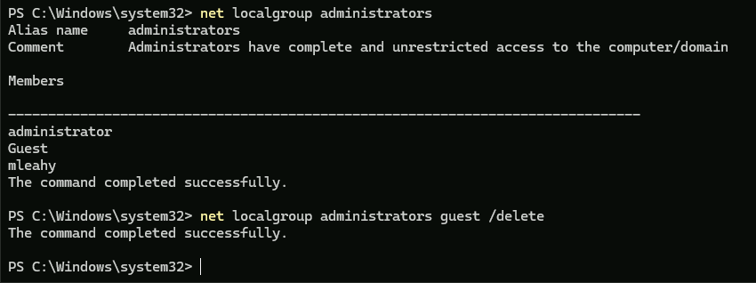
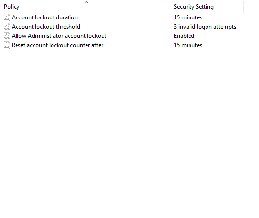

<div align="center">

# 🛡️ Windows 11 DISA STIG Compliance Assessment

### Vulnerability & Security Configuration Assessment Using Tenable Vulnerability Management


</div>

---

## 📌 Project Overview

This project demonstrates a credentialed vulnerability and compliance assessment of a Windows 11 Pro virtual machine hosted in Microsoft Azure using **Tenable Vulnerability Management**.

A disposable Windows 11 VM was intentionally configured with insecure settings to simulate a poorly hardened endpoint. I then created a Tenable **Advanced Network Scan**, authenticated to the Windows host, and evaluated the system against the **DISA Microsoft Windows 11 STIG v2r8** security benchmark.

The project demonstrates two complementary security-assessment activities:

- **Vulnerability Assessment** — identifying software vulnerabilities, missing patches, and vulnerable applications.
- **STIG Compliance Assessment** — evaluating Windows configuration against DISA security-hardening requirements.

> ⚠️ **Lab Disclaimer:** All insecure configurations were intentionally created in an isolated, disposable Azure environment for authorized cybersecurity training.

---

## 🎯 Objectives

- Deploy a Windows 11 VM in Microsoft Azure
- Introduce controlled security misconfigurations for assessment
- Configure Azure networking to support vulnerability scanning
- Create a reusable Tenable Advanced Network Scan template
- Perform a credentialed Windows vulnerability assessment
- Assess the system against the DISA Microsoft Windows 11 STIG v2r8 benchmark
- Identify software vulnerabilities and failed STIG security controls
- Analyze the security impact of identified findings
- Remediate selected vulnerabilities and STIG compliance failures
- Re-scan the system to validate remediation and measure security improvements

---

## 🧰 Technologies & Skills

| Technology / Skill | Purpose |
|---|---|
| Microsoft Azure | Hosted the Windows 11 target system |
| Windows 11 Pro | Assessment target |
| Tenable Vulnerability Management | Vulnerability and compliance scanning |
| DISA Windows 11 STIG v2r8 | Security configuration benchmark |
| Azure NSG | Network access configuration |
| SMB / WMI | Credentialed Windows enumeration |
| Windows Registry | Configuration assessment |
| Windows Defender Firewall | Host firewall assessment |
| Vulnerability Management | Discovery, analysis, and remediation |
| Compliance Auditing | Security baseline validation |

---

# 🧪 Lab Environment

## Azure Windows 11 VM

A Windows 11 Pro virtual machine was deployed in Microsoft Azure as the assessment target.

<details>
<summary><b>📸 View Azure VM</b></summary>

<br>


**Figure 1 — Windows 11 Pro VM deployed in Microsoft Azure.**

</details>

---

# ⚠️ Intentional Security Misconfigurations

To provide detectable security weaknesses for the assessment, several controls were intentionally weakened.

## Windows Firewall Disabled

Windows Defender Firewall was disabled across the Domain, Private, and Public network profiles.

<details>
<summary><b>📸 View Firewall Configuration</b></summary>

<br>


**Figure 2 — Windows Defender Firewall disabled across all profiles.**

</details>

---

## Privileged Local Accounts

The built-in Administrator and Guest accounts were enabled, and the Guest account was added to the local Administrators group.

<details>
<summary><b>📸 View Local Administrator Accounts</b></summary>

<br>


**Figure 3 — Intentionally insecure local account configuration.**

</details>

---

## Permissive Azure Network Security Group

A temporary Azure NSG rule was configured to permit inbound traffic from any source, protocol, and port.

<details>
<summary><b>📸 View Azure NSG Rule</b></summary>

<br>


**Figure 4 — Temporary permissive NSG rule used in the isolated lab.**

</details>

> These configurations significantly increase attack surface and would not be appropriate for a production environment.

---

# 🌐 Connectivity Validation

Connectivity between the workstation and Azure VM was verified before scanning.

<details>
<summary><b>📸 View Connectivity Test</b></summary>

<br>


**Figure 5 — Successful connectivity test to the Azure Windows 11 VM.**

</details>

---

# 🔎 Tenable Scan Configuration

A reusable **Advanced Network Scan** template was created in Tenable Vulnerability Management.

The assessment used Windows credentials so Tenable could perform deeper inspection of the operating system rather than relying only on externally visible network services.

Authenticated enumeration included access to:

- SMB
- WMI
- Windows Registry
- Local users and groups
- Installed software
- Windows services
- Password policy
- Patch information
- System configuration

<details>
<summary><b>📸 View Advanced Network Scan Template</b></summary>

<br>


**Figure 6 — Advanced Network Scan template configured for the Windows 11 assessment.**

</details>

---

# 🛡️ DISA STIG Configuration

The **DISA Microsoft Windows 11 STIG v2r8** audit was added to the Tenable scan.

The benchmark evaluates security controls covering areas such as:

- Account and password policy
- Authentication
- Audit logging
- Windows security options
- User rights
- BitLocker
- Windows Defender
- SMB
- Remote Desktop
- PowerShell
- WinRM
- Credential Guard
- Network security
- System services
- Registry configuration

<details>
<summary><b>📸 View DISA STIG Audit Configuration</b></summary>

<br>


**Figure 7 — DISA Microsoft Windows 11 STIG v2r8 audit configured in Tenable.**

</details>

---

# 📊 Assessment Results

The assessment produced two different types of results:

## Vulnerability Scan

| Severity | Findings |
|:---|---:|
| 🔴 Critical | **0** |
| 🟠 High | **3** |
| 🟡 Medium | **0** |
| 🔵 Low | **1** |
| ℹ️ Informational | **122** |
| **Total** | **126** |

<details>
<summary><b>📸 View Completed Vulnerability Scan</b></summary>

<br>


**Figure 8 — Completed Tenable vulnerability assessment.**

</details>

---

## 🛡️ DISA STIG Compliance Results

The credentialed compliance audit evaluated the system against the **DISA Microsoft Windows 11 STIG v2r8** benchmark.

| Audit Result | Controls |
|:---|---:|
| ❌ Failed | **144** |
| ✅ Passed | **101** |
| ⏭️ Skipped | **0** |
| ⚠️ Error / Info / Warning | **11** |
| **Total Evaluated** | **256** |

The high number of failed controls was expected because the VM had not been hardened to the DISA baseline and several insecure settings were intentionally introduced for the exercise.

<details>
<summary><b>📄 View Full DISA STIG Audit Report</b></summary>

<br>

Add the exported Tenable audit PDF to:

`reports/Windows_11_DISA_STIG_Audit_Report.pdf`

Then link it here:

[View Full DISA Windows 11 STIG Audit Report](reports/Windows_11_DISA_STIG_Audit_Report.pdf)

</details>

---

# 🚨 Selected STIG Findings

Rather than reproducing all 144 failed controls, several findings were selected to demonstrate the types of security weaknesses identified during the audit.

## ❌ WN11-00-000135 — Host-Based Firewall

**Requirement:**  
A host-based firewall must be installed and enabled.

**Result:** `FAILED`

Tenable determined that the required firewall configuration was not enabled for the Windows firewall profiles.

**Security Impact:**  
Disabling the host firewall removes an important layer of protection responsible for controlling inbound and outbound network connections.

**Remediation:**  
Enable Windows Defender Firewall and configure appropriate rules for all required profiles.

---

## ❌ WN11-00-000090 — Password Expiration

**Requirement:**  
Accounts must be configured to require password expiration.

**Result:** `FAILED`

The compliance assessment identified active accounts configured in a manner that did not satisfy the STIG password-expiration requirement.

**Security Impact:**  
Passwords that never expire can remain usable for long periods if credentials are compromised.

**Remediation:**  
Ensure active accounts are configured according to the organization's password-expiration policy and the applicable STIG requirement.

---

## ❌ WN11-SO-000010 — Guest Account

**Requirement:**  
The built-in Guest account must be disabled.

**Result:** `FAILED`

The Guest account had intentionally been enabled as part of the vulnerable lab configuration.

**Security Impact:**  
Unnecessary enabled accounts increase the attack surface and may provide additional opportunities for unauthorized access.

**Remediation:**  
Disable the built-in Guest account.

---

## ❌ WN11-AC-000005 — Account Lockout Duration

**Requirement:**  
Account lockout duration must be configured to **15 minutes or greater**.

**Result:** `FAILED`

The assessed system was configured with a **10-minute** account lockout duration.

**Security Impact:**  
Insufficient lockout controls reduce resistance to repeated password-guessing attacks.

**Remediation:**  
Configure the account lockout duration to at least 15 minutes or use an administrator-controlled unlock policy.

---

## ❌ WN11-00-000031 — BitLocker Pre-Boot Authentication

**Requirement:**  
Windows 11 systems must use a BitLocker PIN for pre-boot authentication.

**Result:** `FAILED`

The required BitLocker startup PIN policy was not configured.

**Security Impact:**  
Pre-boot authentication adds protection against unauthorized access to encrypted data when the operating system is not running.

**Remediation:**  
Configure BitLocker startup authentication according to the applicable STIG requirement.

---

# 💻 Vulnerability Findings

The vulnerability portion of the Tenable assessment identified three High-severity findings and one Low-severity finding.

## 🟠 High — WinVerifyTrust Signature Validation

**Plugin ID:** `166555`

**Finding:**  
WinVerifyTrust Signature Validation CVE-2013-3900 Mitigation (`EnableCertPaddingCheck`)

Tenable identified that the recommended Windows signature-validation mitigation was not enabled.

---

## 🟠 High — Microsoft Outlook Security Update

**Plugin ID:** `193266`

Tenable identified a missing security update affecting Microsoft Outlook for Windows.

---

## 🟠 High — Microsoft Teams Remote Code Execution

**Plugin ID:** `250276`

The installed Microsoft Teams version was identified as affected by a remote code execution vulnerability addressed by a Microsoft security update.

---

## 🔵 Low — Microsoft Teams Elevation of Privilege

**Plugin ID:** `264898`

An installed Microsoft Teams version was identified as affected by an elevation-of-privilege vulnerability.

<details>
<summary><b>📄 View Full Vulnerability Scan Report</b></summary>

<br>

Add the exported Tenable audit PDF to:

`Windows_11_Vulnerability_Scan_Report.pdf'

Then link it here:

[View Full Vulnerability Scan Report](reports/Windows_11_Vulnerability_Scan_Report.pdf)

</details>

---

# 🔐 Credentialed Scan Validation

The scan successfully authenticated to the Windows VM.

Authenticated access allowed Tenable to retrieve security information including:

- Local user accounts
- Administrator group membership
- Windows password policy
- Installed applications
- Windows Registry information
- WMI information
- Windows services
- SMB configuration
- Patch information
- Operating system configuration

This demonstrated why credentialed vulnerability scans provide substantially greater host visibility than basic unauthenticated network scans.

---

# 🛠️ Remediation Priorities

Based on the vulnerability and STIG assessments, remediation should prioritize the following:

| Priority | Finding | Recommended Action |
|---|---|---|
| 🔴 High | Host firewall disabled | Enable and properly configure Windows Defender Firewall |
| 🔴 High | Excessive privileges | Remove Guest and unnecessary accounts from Administrators |
| 🔴 High | Missing security updates | Apply Outlook, Teams, and Windows security updates |
| 🟠 High | Password controls | Enforce expiration, complexity, history, and lockout policies |
| 🟠 High | Azure NSG exposure | Replace allow-all access with least-privilege rules |
| 🟠 High | BitLocker controls | Configure required encryption and pre-boot authentication |
| 🟡 Medium | Audit configuration | Enable required Windows security auditing |
| 🟡 Medium | STIG configuration gaps | Apply applicable DISA Windows 11 hardening settings |

---

# 🔄 Vulnerability Management Workflow

```text
        Deploy Windows 11 VM
                 │
                 ▼
   Introduce Lab Misconfigurations
                 │
                 ▼
     Configure Tenable Scanner
                 │
                 ▼
      Credentialed Assessment
            ┌────┴────┐
            ▼         ▼
    Vulnerability   DISA STIG
       Scan          Audit
            │         │
            └────┬────┘
                 ▼
          Analyze Findings
                 │
                 ▼
        Prioritize Remediation
                 │
                 ▼
          Harden the System
                 │
                 ▼
             Re-scan
```

---

# 🧠 Key Takeaways

This project provided hands-on experience with:

- Microsoft Azure security
- Vulnerability management
- Credentialed vulnerability scanning
- DISA STIG compliance auditing
- Windows security hardening
- Security baseline assessment
- Patch and vulnerability analysis
- Windows account and password policies
- SMB and WMI enumeration
- Security remediation planning
- Interpreting Tenable vulnerability and compliance results

Most importantly, the project demonstrated the difference between **vulnerability management** and **configuration compliance**: vulnerability scanning identified vulnerable software and missing mitigations, while the STIG audit evaluated whether Windows security settings met a defined hardening baseline.

---

# 🧹 Lab Cleanup

After the assessment was completed, the intentionally vulnerable Azure resources were removed to prevent continued exposure of the test environment.

---

# 📁 Repository Structure

```text
tenable-windows11-stig-compliance-scan/
│
├── README.md
│
├── screenshots/
│   ├── 01-azure-vm-overview.png
│   ├── 02-firewall-disabled.png
│   ├── 03-insecure-local-accounts.png
│   ├── 04-nsg-allow-all.png
│   ├── 05-connectivity-test.png
│   ├── Tenable_STIG_Template_config.PNG
│   ├── DISA_STIG_Win11_parameters.PNG
│   ├── STIG_Scan_Completed.PNG
│   └── STIG_Audit_Summary.PNG
│
└── reports/
    └── Windows_11_DISA_STIG_Audit_Report.pdf
```

---

## ⚠️ Disclaimer

This project was conducted exclusively in an authorized cybersecurity lab environment. The vulnerable configurations shown in this repository were intentionally created for educational and security-testing purposes.


# 🔧 Remediation & Validation

Following the initial vulnerability and DISA STIG assessments, selected findings were remediated to reduce the attack surface and improve the Windows 11 VM's compliance with the DISA security baseline.

The remediation phase focused on findings that represented meaningful security risks and could be validated through a follow-up Tenable scan.

## 🛠️ Security Hardening

### 1. Windows Defender Firewall

The initial assessment was performed with Windows Defender Firewall disabled across the Domain, Private, and Public profiles.

**Remediation:** Windows Defender Firewall was re-enabled to restore host-based network protection.

<details>
<summary><b>📸 View Firewall Remediation</b></summary>

<br>



**Figure 10 — Windows Defender Firewall enabled following remediation.**

</details>

---

### 2. Guest Account & Administrative Privileges

The initial configuration had the built-in Guest account enabled and included in the local Administrators group, creating unnecessary privileged access.

**Remediation:**

- Removed the Guest account from the local Administrators group
- Disabled the built-in Guest account
- Verified local Administrators group membership

<details>
<summary><b>📸 View Account Remediation</b></summary>

<br>



**Figure 11 — Local account configuration after removing unnecessary administrative access.**

</details>

---

### 3. Account Security Policy

The DISA STIG assessment identified account-policy settings that did not meet the required security baseline.

**Remediation:** Selected password and account lockout settings were modified to align with the applicable DISA Windows 11 STIG requirements.

<details>
<summary><b>📸 View Security Policy Remediation</b></summary>

<br>



**Figure 12 — Windows account security policy after STIG hardening.**

</details>

---

### 4. Vulnerability Remediation

The initial Tenable vulnerability scan identified **3 High-severity** and **1 Low-severity** vulnerabilities.

Remediation focused on the identified Microsoft application vulnerabilities and Windows security configuration.

**Actions included:**

- Applied applicable Microsoft security updates
- Updated affected Microsoft applications
- Applied the recommended WinVerifyTrust security mitigation
- Verified the affected software and configuration after remediation

---

# 🔄 Post-Remediation Assessment

After completing the hardening changes, the Windows 11 VM was scanned again using the same Tenable assessment methodology.

Using the same assessment approach allowed the initial and post-remediation results to be compared and provided evidence that the security changes were effective.

## 📊 Before vs. After

| Security Metric | Initial Scan | Post-Remediation |
|---|---:|---:|
| Critical Vulnerabilities | **0** | `TBD` |
| High Vulnerabilities | **3** | `TBD` |
| Medium Vulnerabilities | **0** | `TBD` |
| Low Vulnerabilities | **1** | `TBD` |
| Failed STIG Controls | **144** | `TBD` |
| Passed STIG Controls | **101** | `TBD` |

<details>
<summary><b>📸 View Post-Remediation Vulnerability Scan</b></summary>

<br>


**Figure 13 — Tenable vulnerability results following remediation.**

</details>

<details>
<summary><b>📸 View Post-Remediation STIG Assessment</b></summary>

<br>


**Figure 14 — DISA Windows 11 STIG compliance results following security hardening.**

</details>

---

## ✅ Remediation Validation

The post-remediation assessment was used to determine whether the implemented security changes successfully resolved the targeted vulnerabilities and STIG compliance failures.

Where findings remained, they were retained for additional analysis rather than being considered successfully remediated.

This process demonstrated a complete vulnerability-management workflow:

**Identify → Analyze → Prioritize → Remediate → Re-scan → Validate**
